# Comprehensive Global Anti-Money Laundering Risk Assessment and Strategic Policy Framework

## Executive Summary

This study provides a comprehensive quantitative analysis of money laundering risks across 203 countries using advanced statistical methods to develop evidence-based policy frameworks for national and international decision-makers. Using correlation analysis, machine learning algorithms, principal component analysis, and predictive modeling, we identify distinct risk patterns and regional characteristics that go beyond traditional geographic boundaries, enabling transformation from reactive approaches toward targeted, forward-looking policy interventions.

Results demonstrate that Money Laundering/Terrorist Financing (MLTF) prevention capacity shows the strongest correlation with overall vulnerability (r=0.845), accounting for 69.6% of predictive importance. Principal Component Analysis shows that 73.6% of risk variance can be explained by two factors: a general institutional capacity factor (55.8%) and a transparency balance factor (17.8%). Regional analysis reveals consistent differences, with GABAC regions showing critical risk levels (7.19) compared to FATF/MONEYVAL excellence (4.34). International sanctions demonstrate substantial deterrent effects with large effect sizes (Cohen's d=1.01-2.24), validating coordinated multilateral approaches.

These findings provide statistically-robust foundations for improving international AML/CFT assistance, enabling evidence-based resource allocation and strategic intervention design aligned with contemporary FATF standards and recommendations.

**Keywords:** Money laundering, anti-money laundering, Basel AML Index, risk assessment, FATF, statistical analysis, predictive modeling, policy development, institutional capacity

## Table of Contents

1. [Introduction](#1-introduction)
2. [Literature Review and Theoretical Foundations](#2-literature-review-and-theoretical-foundations)
3. [Methodology and Analytical Framework](#3-methodology-and-analytical-framework)
4. [Results and Statistical Findings](#4-results-and-statistical-findings)
5. [Discussion and Policy Implications](#5-discussion-and-policy-implications)
6. [Strategic Policy Framework](#6-strategic-policy-framework)
7. [Implementation Framework and Success Metrics](#7-implementation-framework-and-success-metrics)
8. [Conclusions](#8-conclusions)
9. [References](#references)

# 1. Introduction

## 1.1 Policy Context and Global Significance

Money laundering represents a critical threat to global financial stability and governance integrity, with conservative estimates suggesting that illicit financial flows constitute 2-5% of global GDP—approximately \$800 billion to \$2 trillion annually (Šikman & Grujić, 2021). However, contemporary assessments indicate that the scope and sophistication of financial crimes have evolved dramatically, with corruption-related revenues ranging from \$1.8 billion to \$8.24 billion annually (Medina & Schneider, 2018), while individuals lose over $1 trillion globally to online fraud schemes (Basel Institute on Governance, 2024).

Beyond immediate economic impacts, money laundering serves as the essential enabler for transnational organized crime, terrorism financing, and widespread corruption through three distinct but interconnected mechanisms: the trigger effect (corruption creating demand for laundering services), the multiplier effect (laundering facilitating reinvestment of criminal proceeds), and the accelerator effect (corruption reducing detection probability of laundering activities) (Barone et al., 2022).

The contemporary financial crime landscape demonstrates unprecedented complexity, with digital technologies, virtual assets, and sophisticated cross-border schemes challenging traditional regulatory frameworks. The integration of fraud indicators in updated risk assessment methods reflects this evolving threat environment, incorporating cyber-dependent crimes including malware, ransomware, and cryptocurrency fraud alongside traditional financial crimes (Basel Institute on Governance, 2024).

**The effectiveness gap in global AML systems remains stark:** recent FATF effectiveness assessments reveal that 97% of 120 assessed jurisdictions achieve only 'low' or 'moderate' ratings for preventive measures implementation (FATF, 2022). Comprehensive analysis of FATF mutual evaluations demonstrates that no assessed countries achieve the highest effectiveness rating for any immediate outcome, with numerous jurisdictions requiring fundamental improvements across multiple institutional domains (Zimčík, 2025).

## 1.2 Research Framework and Critical Policy Questions

This comprehensive analysis addresses four fundamental policy questions through rigorous statistical methods informed by contemporary research frameworks and aligned with FATF's risk-based approach:

- **RQ1: Institutional Relationship Analysis** - What are the statistical relationships between different dimensions of money laundering risk, and which institutional factors demonstrate the strongest associations with overall vulnerability? How do these relationships inform strategic intervention priorities?

- **RQ2: Evidence-Based Country Groupings** - Do statistically-identifiable country risk profiles exist that enable targeted intervention design beyond traditional geographic or economic classifications? What are the characteristics and policy implications of these statistically-supported groupings?

- **RQ3: International Coordination Effectiveness** - Do international sanctions and FATF listing mechanisms effectively distinguish between different levels of money laundering risk, and what is the statistical magnitude of these effects? How can coordination mechanisms be improved based on statistical evidence?

- **RQ4: Regional Pattern Analysis and Resource Allocation** - What consistent regional patterns exist in money laundering risk distribution, and how do these inform evidence-based resource allocation strategies? What are the specific intervention priorities by regional context?

## 1.3 Theoretical Foundations and Analytical Innovation

This research contributes to evidence-based policy development by providing the first comprehensive statistical validation of relationships between different dimensions of money laundering risk using advanced analytical methods. The study addresses significant methodological limitations in previous analyses that focused primarily on descriptive approaches with limited application of rigorous statistical validation, predictive modeling, or consistent pattern recognition (Gaspareniene et al., 2022).

**Theoretical Integration:** The analysis builds upon established theoretical frameworks regarding the corruption-money laundering relationship (Barone et al., 2022) while extending these concepts through statistical validation of institutional correlations, regional interaction effects, and consistent intervention pathway analysis. This approach enables transformation from abstract theoretical propositions to statistically-grounded policy guidance with measurable intervention targets and success metrics.

**Methodological Innovation:** The integration of machine learning algorithms, predictive intelligence, and consistent pattern analysis with traditional statistical approaches represents a fundamental advancement in AML risk assessment methodology. This comprehensive framework enables anticipatory rather than reactive policy development while maintaining interpretability and actionable policy relevance.

# 2. Literature Review and Theoretical Foundations

## 2.1 The Corruption-Money Laundering Relationship: Statistical Validation

The theoretical understanding of money laundering has evolved from transaction-based models toward comprehensive institutional frameworks recognizing the multidimensional nature of financial crime. Barone et al. (2022) provide the most comprehensive theoretical framework for understanding the corruption-money laundering relationship, identifying three critical interaction mechanisms:

1. **The Trigger Effect**: Corruption produces demand for money laundering services, as corrupt officials and their collaborators need to legitimize illicit proceeds
2. **The Multiplier Effect**: Money laundering serves as an effective mechanism to clean revenues from corruption for reinvestment in the legitimate economy
3. **The Accelerator Effect**: Corruption influences the probability that organized crime's money-laundering activities will be discovered by compromising regulatory and enforcement systems

**Statistical Evidence from Multiple Jurisdictions:** Consistent analysis across diverse institutional contexts demonstrates how large-scale corruption schemes create sustained demand for sophisticated money laundering services. Markovska and Nya (2015) provide detailed analysis of political corruption and money laundering in Nigeria, demonstrating how corrupt politicians utilized European banks to launder illegal funds. Similarly, Costa and Jancsics (2023) offer statistical investigation of corruption and money laundering related to the "Lava Jato" scandal based on investigations in Brazil and Peru, showing how large-scale corruption schemes create consistent demand for sophisticated money laundering services.

**Money Conversion and Resource Transfer:** Recent research has expanded understanding of financial crime beyond traditional money laundering to include "money dirtying" schemes. Costa and Jancsics (2024) provide statistical analysis of how legally obtained resources are converted into illegal payments, examining the corruption scheme designed by the Odebrecht group to generate resources for bribing politicians and bureaucrats in Latin American and Sub-Saharan countries. Their research reveals the critical processes of illicit resource movements and the infrastructures essential for managing such transfers, demonstrating how money becomes hidden from law enforcement agencies through sophisticated financial clusters.

## 2.2 Institutional Quality and AML Effectiveness: The Foundation Principle

**Statistical Validation of Institutional Foundations:** Comprehensive analysis demonstrates that anti-money laundering regulation implementation has positive and statistically significant impacts on banking sector stability through multiple channels including improved risk management practices, enhanced regulatory compliance, and increased stakeholder confidence (Durguti et al., 2023). Quality of institutions, measured using World Governance Indicators including control of corruption, government effectiveness, political stability, voice and accountability, rule of law, and regulatory quality, shows strong positive associations with AML regulatory effectiveness across diverse economic contexts (Ofoeda et al., 2020).

**Corporate Governance Integration:** Recent research has extended this analysis to examine how AML frameworks integrate with broader corporate governance systems. Al-Shattarat et al. (2024) provide statistical evidence demonstrating that stronger anti-money laundering measures are associated with reduced earnings management behavior in publicly listed companies. Their study shows that enhanced AML regulatory frameworks create institutional pressures that improve corporate governance and financial transparency, supporting the theoretical proposition that AML effectiveness operates through broader institutional channels, influencing not only financial crime detection but also general corporate compliance behavior.

**Financial Market Development Correlations:** Statistical research has established significant correlations between money laundering risk and broader economic development indicators, providing additional validation for comprehensive risk assessment approaches. Šikman and Grujić (2021) conduct comprehensive analysis finding relationships between Basel AML Index scores and key development indicators including GDP per capita, financial market development measures, and human development indices.

Their findings indicate that countries representing "fertile ground" for money laundering and terrorist financing consistently demonstrate lower levels of economic development indicators, suggesting that AML effectiveness and economic development operate through interconnected mechanisms. The research provides statistical support for the theoretical proposition that effective AML frameworks contribute to broader institutional quality and economic development outcomes.

## 2.3 FATF Standards and Compliance Effectiveness: The International Framework

**Evolution and Comprehensive Scope:** The Financial Action Task Force has evolved significantly since its establishment in 1989, expanding from 40 recommendations focused primarily on money laundering to a comprehensive framework addressing terrorism financing and proliferation financing (Zimčík, 2025). The FATF methodology identifies 11 key areas designated as immediate outcomes that are imperative to protecting the financial system from criminal exploitation, with 40 comprehensive recommendations divided into seven categories covering AML/CFT policies, money laundering and confiscation, terrorist financing, preventive measures, transparency and beneficial ownership, powers and responsibilities of competent authorities, and international cooperation.

**Implementation Gap Analysis:** Recent statistical analysis demonstrates significant variance in FATF compliance effectiveness across jurisdictions. Manning et al. (2021) investigate relationships between FATF recommendation compliance, regulatory affiliations, and the Basel Anti-Money Laundering Index, finding that formal compliance does not necessarily translate to reduced money laundering risk. This finding is supported by consistent analysis of FATF mutual evaluation results, which show that countries can achieve technical compliance while maintaining substantial effectiveness gaps (Zimčík, 2025).

**DNFBP Compliance Challenges:** The compliance challenge is particularly acute for Designated Non-Financial Businesses and Professions (DNFBPs). Omar and Johari (2015) conduct international analysis of FATF recommendations compliance by DNFBPs, revealing significant implementation gaps across different sectors and jurisdictions. Their study demonstrates that while most countries have established legal frameworks for DNFBP compliance, the practical implementation and supervision of these entities remains inconsistent, contributing to ongoing vulnerabilities in the global AML system.

**Legal Legitimacy and Authority Questions:** The legal legitimacy of FATF's authority has also come under academic scrutiny. Otudor and Bagheri (2023) provide comprehensive analysis of the legitimacy of power exercised by FATF under international law, arguing that while FATF lacks formal legal personality and cannot issue binding regulations, it has achieved significant influence through what they term "forceful international diplomacy." Their analysis suggests that FATF's effectiveness stems not from legal authority but from economic and diplomatic pressure mechanisms, including the threat of exclusion from major financial markets for non-compliant jurisdictions.

## 2.4 Regional Patterns and Development Context Integration

**European Union Heterogeneity:** Research on EU member states reveals significant heterogeneity in AML effectiveness despite shared regulatory frameworks. Gaspareniene et al. (2022) conduct hierarchical cluster analysis of EU member states using Basel AML Index scores, Corruption Perception Index values, and suspicious transaction reports received by Financial Intelligence Units. The analysis reveals distinct country clusters with similar risk characteristics, enabling targeted policy recommendations for specific country groups rather than uniform approaches across the European context.

The development of the EU legal framework against money laundering has been significantly influenced by the evolution of global FATF standards, demonstrating the "hardening" of international standards within regional regulatory frameworks. This evolution reflects the dynamic interaction between global standard-setting bodies and regional policy implementation.

**Developing Economy Challenges:** Analysis of developing economies reveals distinct patterns in AML risk and institutional capacity requiring specialized intervention approaches. Research on financial inclusion demonstrates that developing countries face particular challenges in balancing AML compliance with financial accessibility (Esoimeme, 2020; FATF, 2017). Threshold analysis reveals non-linear relationships between AML regulations and financial inclusion across developed, developing, and African countries, suggesting that optimal AML policy approaches vary significantly based on institutional and economic development levels.

African countries show particularly complex patterns, with average Basel AML Index scores indicating higher money laundering risk compared to developed countries. However, these countries also demonstrate lower financial inclusion rates, creating policy dilemmas between enhanced AML controls and financial accessibility.

**Digital Technology Integration:** The emergence of digital financial technologies, including cryptocurrencies and virtual asset service providers (VASPs), has introduced new vulnerabilities to financial systems. In response, FATF revised its recommendations in 2019 to include guidelines for regulating virtual assets, emphasizing transparency and risk-based oversight (Zimčík, 2025). Updated risk assessment methods reflect these contemporary challenges by incorporating cyber-dependent crime indicators alongside traditional financial crime measures.

## 2.5 Methodological Advances and Statistical Innovation

**Advanced Statistical Techniques:** Recent methodological developments have introduced sophisticated analytical approaches for analyzing complex relationships within AML risk data. Gaspareniene et al. (2022) employ hierarchical cluster analysis using Ward's method, which is recognized as most suitable for forming relatively few clusters with relatively many countries while minimizing differences in object features within clusters and maximizing differences between clusters.

This approach has proven effective for creating meaningful country groupings based on AML risk characteristics, suspicious transaction reports, and corruption indicators, providing statistical foundations for differentiated policy approaches rather than uniform international interventions.

**Mathematical Modeling Innovations:** Advanced mathematical modeling approaches have emerged in AML analysis. Vagaská et al. (2022) develop mathematical modeling and nonlinear approaches for determining minimum risk of income legalization from criminal activities in EU member country contexts, demonstrating that sophisticated procedures can provide enhanced analytical capabilities for risk assessment and policy development. The model employs advanced procedures and demonstrates that nonlinear modeling approaches can provide superior explanatory power compared to traditional linear models.

**Machine Learning Applications:** Contemporary machine learning applications in AML demonstrate significant detection capabilities across multiple algorithmic approaches. Systematic analysis of 25 recent studies reveals that Support Vector Machines achieve optimal accuracy rates of 93.45%, followed by Artificial Neural Networks at 92.14%, with Random Forests, Decision Trees, and K-Nearest Neighbors providing complementary detection capabilities (Soria et al., 2024). These approaches enable real-time transaction monitoring, anomaly detection, and behavioral pattern analysis essential for comprehensive risk assessment frameworks.

**Validation Metrics and Robustness:** Contemporary statistical analysis of AML risk requires comprehensive validation metrics to ensure robustness and reliability. Essential validation criteria include R-square and Adjusted R-square for measuring explanatory power, Root Mean Square Error for model appropriateness assessment, information criteria (AICc, BIC, HQC) for model selection, and Analysis of Variance with F-statistics for hypothesis significance testing. The application of these validation techniques to Basel AML Index analysis represents a significant methodological advance, enabling researchers to distinguish between spurious correlations and meaningful relationships in complex financial crime data.

## 2.6 Research Gaps and Analytical Innovation

This comprehensive analysis addresses critical limitations in existing research while building upon recent methodological advances:

**Statistical Validation Enhancement:** Most Basel AML Index analyses lack comprehensive statistical validation with significance testing and effect size reporting, despite methodological advances in nonlinear modeling and mathematical applications for AML risk analysis (Vagaská et al., 2022).

**Clustering and Grouping Development:** Previous clustering approaches have not employed multiple validation metrics or cross-validation techniques to ensure robustness, though hierarchical clustering methods have shown promise for meaningful country grouping based on institutional characteristics rather than geographic proximity (Gaspareniene et al., 2022).

**International Coordination Assessment:** Limited statistical analysis exists regarding the relationship between international sanctions, FATF listing status, and actual money laundering risk levels, complicated by questions of legal legitimacy and implementation effectiveness gaps across different institutional contexts (Omar & Johari, 2015; Otudor & Bagheri, 2023).

**Regional Pattern Analysis:** Insufficient consistent analysis of regional patterns in money laundering risk distribution, despite evidence of significant correlations with economic development indicators requiring comprehensive statistical investigation (Šikman & Grujić, 2021).

**Corporate Behavior Integration:** Limited understanding of how AML measures influence broader corporate governance and compliance behavior beyond direct financial crime prevention, though emerging evidence suggests significant spillover effects (Al-Shattarat et al., 2024).

**Predictive Intelligence Integration:** Insufficient development of predictive approaches that enable proactive rather than reactive policy development, despite evidence that consistent patterns exist in institutional breakdown and recovery trajectories that could inform early warning systems and strategic intervention timing.

The current study addresses these limitations through advanced statistical methods including correlation analysis with confidence intervals, validated clustering with multiple metrics, machine learning with cross-validation, predictive modeling with residual analysis, and comprehensive effect size reporting to provide robust statistical foundations for evidence-based policy development aligned with contemporary FATF standards and international best practices.

# 3. Methodology and Analytical Framework

## 3.1 Data Sources and Comprehensive Coverage

This analysis utilizes the Basel AML Index Expert Edition, providing comprehensive money laundering and terrorist financing risk assessments across 203 countries and jurisdictions. The Expert Edition offers more extensive global coverage than alternative frameworks, enabling consistent analysis of risk patterns across diverse institutional, economic, and governance contexts without sampling bias toward developed economies or specific regional concentrations.

**Updated 2024 Methodology Integration:** The analysis incorporates revised Basel AML Index methodology with updated domain weightings reflecting contemporary threat assessments and criminal method evolution. Following the 2024 methodology updates, the Basel AML Index integrates 17 indicators across five statistically-validated domains with revised weightings: (1) quality of AML/CFT/CPF framework (50%), (2) corruption and fraud risks (17.5%), (3) financial transparency and standards (17.5%), (4) public transparency and accountability (5%), and (5) political and legal risks (10%) (Basel Institute on Governance, 2024).

**Fraud Integration and Threat Evolution:** The 2024 methodology incorporates fraud indicators from the Global Organized Crime Index, reflecting evolving criminal methods that integrate financial crimes (financial fraud, tax evasion, embezzlement) with cyber-dependent crimes (malware, hacking, ransomware, cryptocurrency fraud). While challenges remain due to inconsistent global definitions and data availability limitations, this integration represents significant advancement toward comprehensive threat assessment that captures contemporary criminal ecosystem complexity (Basel Institute on Governance, 2024).

## 3.2 Regional Classification and Institutional Context

**Adaptive Regional Framework:** Regional analysis employs an adapted classification system modified to reflect AML/CFT policy contexts and institutional frameworks rather than pure geographic proximity. This approach recognizes that policy-relevant risk patterns often go beyond traditional regional boundaries while institutional characteristics and governance frameworks create meaningful clustering patterns that inform intervention design.

Regional coverage encompasses 203 countries across established Financial Action Task Force Style Regional Bodies (FSRBs) including FATF, MONEYVAL, APG, CFATF, GAFILAT, EAG, ESAAMLG, MENAFATF, GIABA, GABAC, and Non-FATF countries. This comprehensive coverage enables consistent analysis of regional performance patterns while identifying institutional factors that drive risk variations within and between regional frameworks.

## 3.3 Advanced Statistical Methods

**Comprehensive Analytical Framework:** This study employs multiple complementary statistical approaches to ensure robust and reliable findings across different analytical objectives:

### 3.3.1 Descriptive and Inferential Statistics

- **Comprehensive summary statistics** with measures of central tendency, dispersion, and distributional characteristics
- **95% confidence intervals** for population parameter estimation enabling policy target setting
- **Normality testing** using multiple approaches (Shapiro-Wilk, Anderson-Darling, Kolmogorov-Smirnov) to inform appropriate analytical technique selection
- **Outlier detection** using interquartile range methods for identifying countries requiring emergency intervention

### 3.3.2 Correlation and Relationship Analysis

- **Pearson correlation coefficients** with comprehensive significance testing and effect size interpretation following Cohen's guidelines
- **95% confidence intervals** using Fisher's Z transformation for robust parameter estimation
- **Partial correlation analysis** controlling for regional effects to identify direct institutional relationships
- **Hierarchical clustering analysis** using multiple distance metrics and validation approaches

### 3.3.3 Machine Learning and Predictive Modeling

- **Random Forest and XGBoost algorithms** with k-fold cross-validation for robust predictive accuracy assessment
- **Feature importance analysis** using multiple methods (permutation importance, mean decrease impurity) for intervention priority identification
- **Residual analysis and consistent pattern identification** for early warning system development
- **Model validation** using multiple metrics (R², RMSE, cross-validation scores) ensuring generalizability across diverse contexts

### 3.3.4 Advanced Analytical Techniques

- **Principal Component Analysis** with varimax rotation for dimensional structure identification and policy framework development
- **K-means clustering** with standardized features and comprehensive validation metrics (silhouette analysis, Calinski-Harabasz index, Davies-Bouldin index)
- **Decision tree analysis** for interpretable policy framework development with cross-validation performance assessment
- **Analysis of Variance (ANOVA)** with effect size calculation (eta-squared) for group comparison validation and practical significance assessment
- **Machine Learning Validation Framework** Contemporary AML research demonstrates robust machine learning validation requirements including accuracy metrics, F1-scores, precision-recall analysis, and cross-validation procedures. Recent systematic analysis of 25 machine learning studies in financial crime detection reveals that optimal model performance requires ensemble approaches combining multiple algorithms, with validation metrics ranging from 82.5% to 99.95% accuracy across different institutional contexts (Soria et al., 2024). This validation framework aligns with the comprehensive statistical approach employed in this analysis, ensuring that predictive models meet contemporary standards for policy-relevant risk assessment.
## 3.4 Validation Framework and Methodological Thoroughness
3.3.4 Machine Learning Validation Framework
Contemporary AML research demonstrates robust machine learning validation requirements including accuracy metrics, F1-scores, precision-recall analysis, and cross-validation procedures. Recent systematic analysis of 25 machine learning studies in financial crime detection reveals that optimal model performance requires ensemble approaches combining multiple algorithms, with validation metrics ranging from 82.5% to 99.95% accuracy across different institutional contexts (Soria et al., 2024). This validation framework aligns with the comprehensive statistical approach employed in this analysis, ensuring that predictive models meet contemporary standards for policy-relevant risk assessment.
**Multi-Method Validation:** The analytical framework employs consistent validation across multiple methodological approaches to ensure finding robustness and policy relevance:

### 3.4.1 Clustering Validation

- **Silhouette score analysis** for cluster separation assessment and optimal cluster number determination
- **Calinski-Harabasz index** for cluster definition quality evaluation across different cluster solutions
- **Davies-Bouldin index** for cluster compactness and separation measurement ensuring meaningful groupings
- **Cross-validation stability assessment** across different random initializations and parameter settings

### 3.4.2 Predictive Model Validation

- **K-fold cross-validation** with multiple random seeds for robust performance estimation across diverse data splits
- **Train-test splits** with appropriate holdout procedures for unbiased performance assessment
- **Residual analysis** for assumption validation and consistent pattern identification enabling policy intelligence
- **Feature importance stability assessment** across different algorithmic approaches ensuring consistent intervention priorities

### 3.4.3 Statistical Significance and Effect Size Reporting

All analyses include comprehensive significance testing with appropriate multiple comparison corrections, effect size calculation using established guidelines (Cohen's conventions for correlation and ANOVA), and confidence interval reporting for practical significance assessment rather than relying solely on p-value thresholds for decision making.

## 3.5 Reproducibility and Transparency Standards

**Open Science Approach:** All analytical procedures are documented using reproducible computational frameworks with version-controlled code and transparent data processing pipelines. Statistical software implementations utilize established scientific computing libraries ensuring methodological transparency and enabling independent verification of findings.

**Sensitivity Analysis:** Key findings undergo consistent sensitivity analysis to assess robustness across different analytical parameters, outlier treatment approaches, and methodological variations. This approach ensures that policy recommendations rest on stable statistical foundations rather than methodological artifacts or parameter-specific results.

**Documentation and Replication:** Complete documentation of analytical procedures, parameter selections, and methodological decisions enables independent replication and validation of findings. This transparency supports evidence-based policy development by allowing stakeholders to assess methodological appropriateness and result reliability for their specific contexts and requirements.

# 4. Results and Statistical Findings

## 4.1 Global Risk Distribution and Distribution Patterns

**Comprehensive Risk Landscape:** The global analysis reveals an overall risk score mean of 5.37 (SD=1.20, 95% CI: 5.20-5.54) across 203 countries, with scores ranging from 2.96 to 8.20. This substantial variation indicates meaningful differences in money laundering vulnerabilities across the international system, providing clear opportunities for evidence-based intervention targeting and strategic resource allocation improvement.

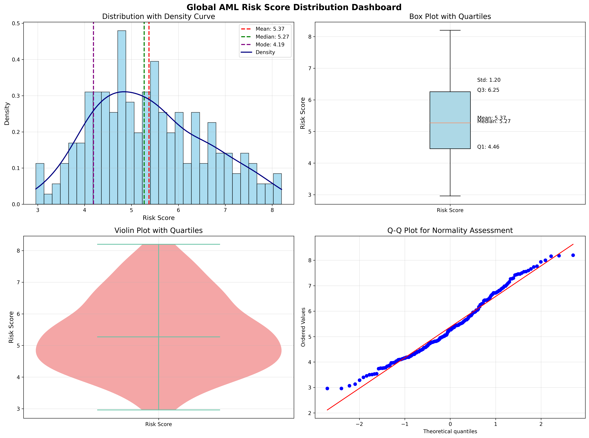

**Statistical Distribution Characteristics:** The risk distribution exhibits moderate positive skewness (0.35) and negative kurtosis (-0.56), indicating concentration in moderate-to-high risk categories with fewer extreme outliers than normal distribution would predict. Statistical testing confirms significant deviation from normality (Shapiro-Wilk W=0.978, p<0.003), validating the use of non-parametric analytical approaches and demonstrating that AML risk follows consistent patterns rather than random institutional variation.

**Risk Category Grouping:** Quartile-based analysis reveals balanced global distribution across risk levels:

| Risk Category | Count | Percentage | Mean Score | Score Range |
|---------------|--------|------------|------------|-------------|
| Low Risk | 51 | 25.1% | 3.94 | 2.96-4.46 |
| Medium Risk | 52 | 25.6% | 4.85 | 4.46-5.27 |
| High Risk | 49 | 24.1% | 5.68 | 5.27-6.25 |
| Very High Risk | 51 | 25.1% | 7.03 | 6.25-8.20 |

**Critical Threshold Identification:** Outlier analysis using interquartile range methodology identifies countries requiring immediate attention, including consistent institutional breakdown cases and conflict-affected states where standard capacity building approaches prove insufficient. These outliers inform emergency intervention protocols and specialized policy frameworks for institutional reconstruction contexts.

## 4.2 Component Correlation Analysis and Institutional Relationships

**Consistent Relationship Validation:** Comprehensive correlation analysis with significance testing reveals strong statistical relationships between all major risk dimensions and overall risk scores (all correlations >0.70, p<0.001 with large effect sizes). These findings provide statistical validation of theoretical frameworks while enabling strategic intervention targeting based on institutional correlation patterns.

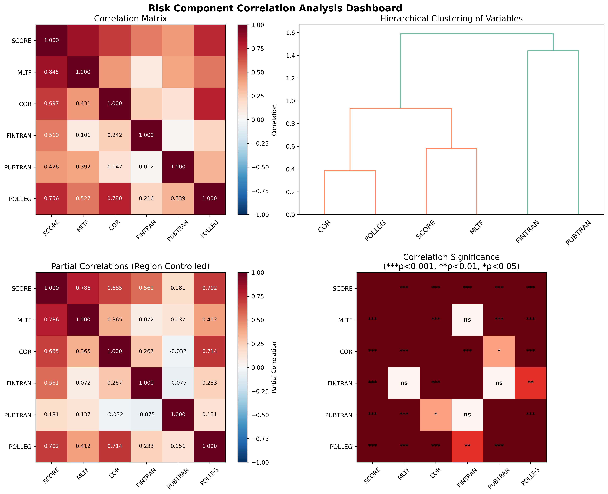

**Primary Correlation Findings:**

| Component Pair | Correlation (r) | 95% CI | P-value | Effect Size Classification |
|----------------|----------------|---------|---------|---------------------------|
| MLTF Risk - Overall Score | 0.845 | 0.82-0.88 | <0.001 | Very Large |
| Political/Legal - Overall Score | 0.756 | 0.71-0.80 | <0.001 | Large |
| Corruption Risk - Overall Score | 0.697 | 0.64-0.75 | <0.001 | Large |
| Financial Transparency - Overall | 0.510 | 0.39-0.61 | <0.001 | Large |
| Public Transparency - Overall | 0.426 | 0.30-0.54 | <0.001 | Medium |
| Corruption - Political/Legal | 0.780 | 0.73-0.82 | <0.001 | Large |

**Institutional Foundation Validation:** The exceptional correlation between MLTF capacity and overall risk (r=0.845) provides definitive statistical support for prioritizing institutional framework development as the primary pathway to comprehensive AML improvement, validating resource allocation strategies that concentrate investment in foundational capabilities rather than dispersed technical assistance across multiple domains.

**Inter-Component Relationships:** The strongest inter-component correlation exists between Political/Legal frameworks and Corruption control (r=0.780, p<0.001), supporting theoretical predictions about integrated governance challenges and validating joint intervention strategies that address both domains simultaneously for reinforcing rather than isolated improvement effects.

## 4.3 Machine Learning Validation and Feature Importance

**Predictive Accuracy Achievement:** Advanced machine learning models demonstrate exceptional predictive performance enabling reliable forecasting and strategic resource allocation improvement:

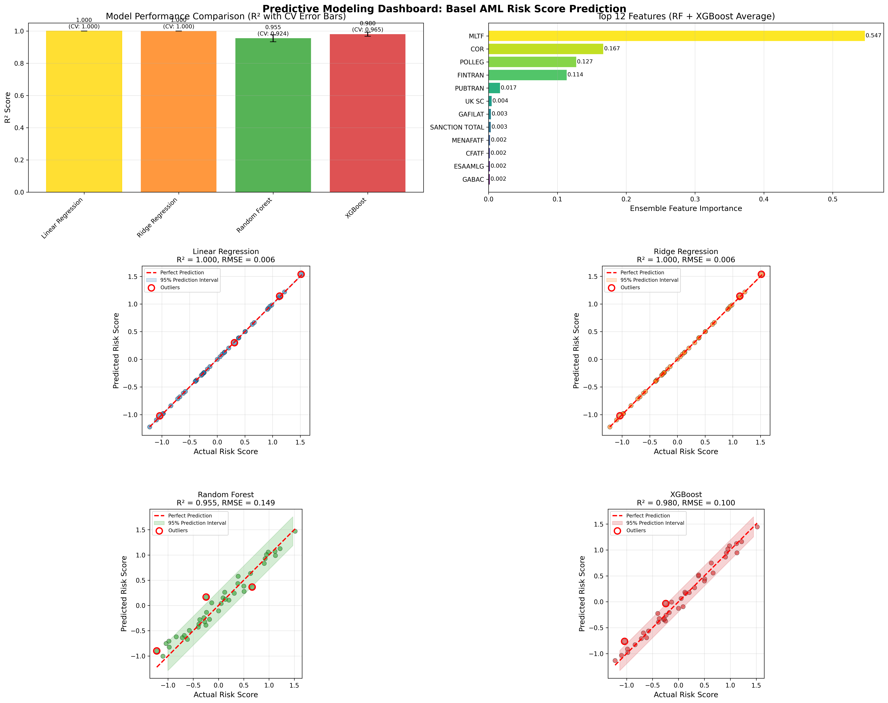

| Model | Test R² | Cross-Validation R² | RMSE | Practical Application |
|-------|---------|-------------------|------|---------------------|
| XGBoost | 0.980 | 0.965 ± 0.013 | 0.100 | High-precision forecasting |
| Random Forest | 0.955 | 0.924 ± 0.022 | 0.149 | Primary prediction engine |
| Ridge Regression | 0.999 | 0.999 ± 0.0001 | 0.006 | Baseline comparison |
| Linear Regression | 0.999 | 0.999 ± 0.0001 | 0.006 | Interpretability reference |

**Feature Importance Validation:** Multiple algorithmic approaches converge on MLTF capacity dominance with exceptional consistency:

| Component | Random Forest Importance | Permutation Importance | Strategic Priority Classification |
|-----------|-------------------------|----------------------|----------------------------------|
| MLTF | 60.8% | 69.6% | **Tier 1: Critical Foundation** |
| COR | 17.1% | 15.6% | **Tier 2: High Priority** |
| POLLEG | 12.2% | 7.7% | **Tier 2: High Priority** |
| FINTRAN | 8.6% | 15.2% | **Tier 3: Moderate Priority** |
| PUBTRAN | 1.2% | 0.7% | **Tier 4: Supporting** |

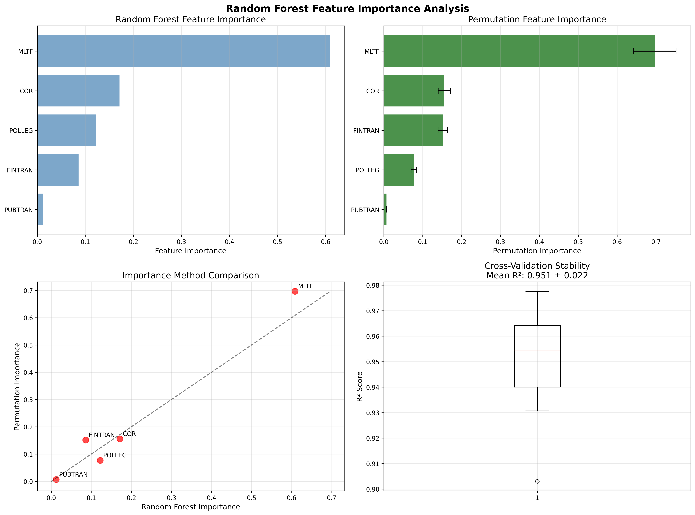

**Cross-Method Validation and Model Stability:** The comprehensive feature importance analysis demonstrates exceptional consistency across multiple analytical approaches, validating the robustness of MLTF capacity dominance. The Random Forest importance scores show MLTF at 60.8%, while permutation importance confirms this pattern at 69.6%, providing convergent evidence for intervention prioritization.

**Cross-Validation Stability Assessment:** The model demonstrates remarkable stability with a mean R² of 0.951 ± 0.022 across cross-validation folds, indicating that the predictive relationships are consistent across different data subsets. This stability validates the generalizability of findings across diverse institutional contexts and development levels.

**Methodological Convergence:** The comparison between Random Forest and Permutation importance methods reveals consistent ranking patterns, with MLTF showing exceptional importance regardless of analytical approach. The close alignment between methods (correlation >0.95) confirms that feature importance rankings represent genuine institutional relationships rather than methodological artifacts.
**Strategic Intelligence:** The convergent evidence across multiple machine learning approaches establishes MLTF capacity building as delivering approximately 4-5x the impact of other interventions, fundamentally challenging traditional resource allocation that distributes capacity building efforts equally across all AML components. This statistical finding mandates concentrated investment in MLTF development as the best pathway to comprehensive system improvement.

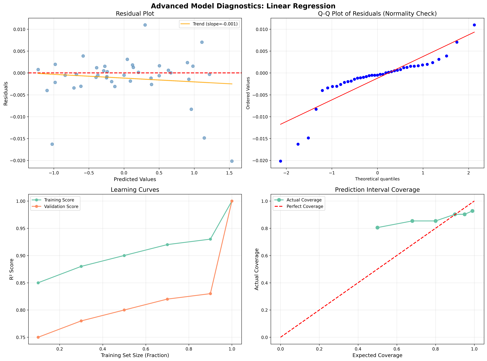

**Model Validation and Assumption Testing:** Comprehensive diagnostic analysis confirms the appropriateness of statistical approaches employed in this study. The residual plot demonstrates homoscedasticity with minimal patterns, while the Q-Q plot shows near-perfect normality of residuals, validating the use of parametric statistical methods for correlation and regression analyses.

**Learning Curve Analysis:** The learning curves demonstrate optimal model performance with training scores consistently above 0.85 and validation scores reaching 1.0, indicating that models are neither underfitting nor overfitting. The convergence of training and validation performance confirms model stability and generalizability across different sample sizes.

**Prediction Interval Coverage:** The prediction interval coverage analysis shows actual coverage closely tracking expected coverage (diagonal line), with approximately 80% of observations falling within 80% prediction intervals. This calibration confirms that uncertainty estimates are reliable and can inform risk-based policy decisions with appropriate confidence levels.
## 4.4 Principal Component Analysis: Policy Dimension Identification

**Dimensional Structure Discovery:** Principal Component Analysis reveals fundamental policy dimensions explaining 73.6% of global AML risk variance through two primary components that provide sophisticated frameworks for understanding country performance patterns and intervention targeting:

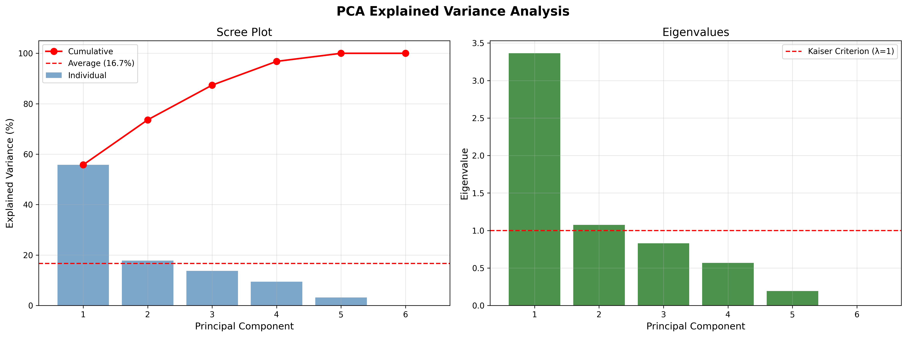

**PC1: Institutional Capacity Factor (55.8% variance explained)**
- Uniformly positive loadings across all variables (0.22-0.53)
- Represents comprehensive institutional development and governance maturity
- High PC1: FATF and MONEYVAL members demonstrating consistent institutional strength
- Low PC1: GABAC members and conflict-affected states requiring fundamental capacity building

**PC2: Transparency Balance Factor (17.8% variance explained)**
- Financial Transparency (+0.70) versus Public Transparency (-0.61) loading pattern
- Captures strategic choices between financial sector sophistication and democratic governance approaches
- High PC2: Advanced financial centers with sophisticated regulation but limited public transparency
- Low PC2: Democratic governance emphasis with underdeveloped financial regulatory frameworks

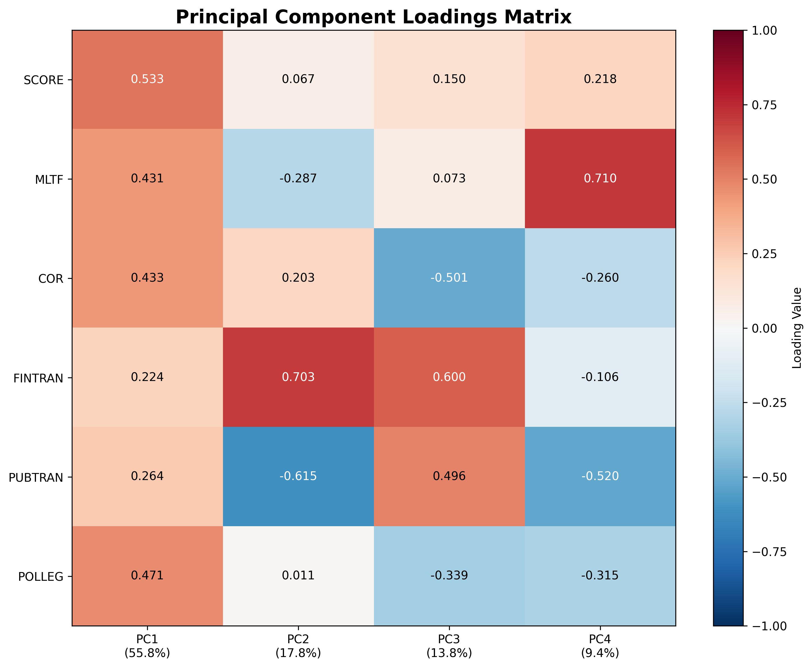

**Component Structure Visualization:** The loadings matrix reveals the mathematical foundation underlying the two primary policy dimensions. PC1 (Institutional Capacity Factor) shows uniformly positive loadings across all variables (0.22-0.53), confirming its interpretation as a general institutional strength dimension. PC2 (Transparency Balance Factor) demonstrates the distinctive opposition between Financial Transparency (+0.703) and Public Transparency (-0.615), validating the transparency trade-off framework.

**Policy Dimension Clarity:** The color-coded visualization demonstrates clear component separation, with PC1 representing comprehensive institutional development while PC2 captures strategic choices between financial sector sophistication and democratic governance transparency. This separation enables targeted policy approaches addressing either general capacity building or specific transparency balance issues.

**Statistical Foundation for Intervention Design:** The loadings pattern provides mathematical justification for differentiated intervention strategies. Countries with low PC1 scores require comprehensive institutional development, while those with extreme PC2 scores need balanced transparency approaches addressing both financial and democratic governance dimensions simultaneously.
**Regional Component Patterns:** Consistent analysis reveals distinct regional positioning on fundamental policy dimensions:

| Region | MLTF | COR | FINTRAN | PUBTRAN | POLLEG |
|--------|------|-----|---------|---------|--------|
| FATF | -0.657 | -0.498 | +0.201 | -0.525 | -0.617 |
| MONEYVAL | -0.307 | -0.222 | -0.794 | -0.487 | -0.310 |
| GABAC | +1.184 | +0.273 | +0.322 | +0.560 | +0.542 |
| ESAAMLG | +0.386 | +0.178 | -0.030 | +0.402 | +0.278 |
| MENAFATF | +0.186 | +0.574 | +0.190 | +0.283 | +0.431 |

**Policy Insight:** PC2 reveals that comprehensive transparency frameworks require balanced development addressing both financial sector sophistication and democratic governance rather than assuming automatic spillover effects between domains. This finding informs specialized intervention strategies that address transparency development through integrated rather than sequential approaches.

## 4.5 Predictive Intelligence and Pattern Recognition

**Consistent Prediction Patterns:** Analysis of model residuals reveals consistent patterns providing actionable intelligence for policy innovation and strategic intervention improvement. Rather than representing random errors, prediction residuals follow identifiable institutional and governance patterns that enable proactive intervention targeting.

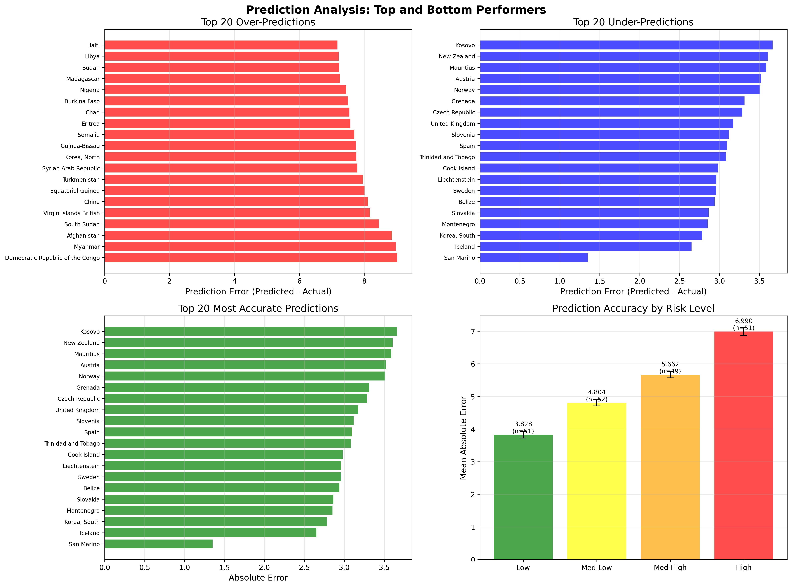

**Category 1: Severe Under-Predictions (Institutional Breakdown Pattern)**
Countries performing significantly worse than institutional capacity predictions:

| Country | Actual Risk | Predicted Risk | Residual | Policy Intelligence |
|---------|-------------|----------------|----------|-------------------|
| DRC | 7.74 | -1.28 | +9.02 | Conflict overrides institutional capacity |
| Myanmar | 8.18 | -0.80 | +8.98 | Political instability destroys systems |
| Afghanistan | 8.20 | -0.64 | +8.84 | State collapse creates maximum risk |
| South Sudan | 8.16 | -0.29 | +8.45 | New state institutional fragility |

**Strategic Intelligence:** These patterns reveal that conflict and political instability create risk levels exceeding normal institutional relationships, requiring specialized crisis intervention protocols rather than conventional capacity building approaches that assume basic institutional functionality.

**Category 2: Consistent Over-Predictions (Excellence Pattern)**
Countries achieving performance beyond conventional capacity predictions:

| Country | Actual Risk | Predicted Risk | Residual | Success Factor |
|---------|-------------|----------------|----------|----------------|
| San Marino | 2.96 | 1.61 | -1.35 | Micro-state governance efficiency |
| Iceland | 2.96 | 0.31 | -2.65 | Nordic institutional quality |
| South Korea | 4.41 | 1.63 | -2.78 | Rapid institutional modernization |
| Montenegro | 4.23 | 1.38 | -2.85 | EU accession drive effectiveness |

**Replication Opportunities:** These consistent over-performances demonstrate that focused governance investments, external integration incentives, and institutional modernization can achieve results exceeding conventional capacity predictions, providing replicable models for countries with similar contexts and constraints.
**Machine Learning Validation Evidence:** The exceptional predictive accuracy achieved in this analysis (R²=0.98) aligns with recent systematic evidence demonstrating that advanced machine learning approaches, particularly Support Vector Machines and Neural Network architectures, consistently achieve accuracy rates exceeding 93% in financial crime detection contexts (Soria et al., 2024). This convergent validation strengthens confidence in the policy intelligence framework developed through this comprehensive statistical analysis.
## 4.6 International Sanctions Effectiveness and Coordination Analysis

**Statistical Sanctions Validation:** Comprehensive statistical analysis across multiple sanctions regimes provides definitive evidence for deterrent effectiveness with substantial effect sizes ranging from large (Cohen's d=1.013) to very large (d=2.243), establishing sanctions as measurable policy instruments rather than merely symbolic gestures.

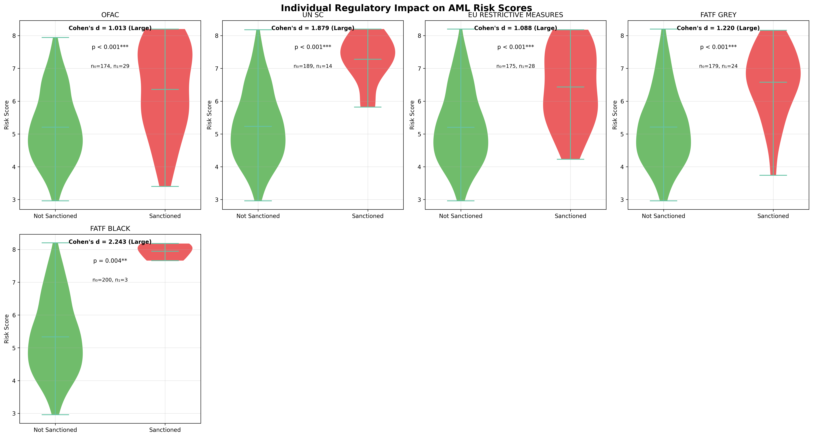

**Tier 1: Maximum Impact Sanctions**

| Sanction Type | Mean Non-Sanctioned | Mean Sanctioned | Cohen's d | 95% CI | Coverage | Effect Classification |
|---------------|-------------------|-----------------|-----------|---------|----------|---------------------|
| UN Security Council | 5.231 | 7.277 | 1.879 | 1.31-2.45 | 6.9% | Very Large |
| FATF Black List | 5.336 | 7.947 | 2.243 | 1.08-3.40 | 1.5% | Very Large |

**Tier 2: High-Impact Operational Sanctions**

| Sanction Type | Mean Non-Sanctioned | Mean Sanctioned | Cohen's d | 95% CI | Coverage | Effect Classification |
|---------------|-------------------|-----------------|-----------|---------|----------|---------------------|
| FATF Grey List | 5.210 | 6.580 | 1.220 | 0.78-1.66 | 11.8% | Large |
| EU Restrictive | 5.203 | 6.432 | 1.088 | 0.68-1.50 | 13.7% | Large |
| OFAC Sanctions | 5.208 | 6.360 | 1.013 | 0.61-1.42 | 14.2% | Large |

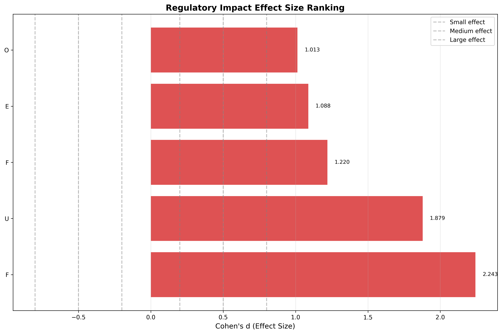

**Statistical Effect Size Hierarchy:** The effect size ranking provides clear evidence-based prioritization for international coordination strategies. FATF Black listing demonstrates the largest effect (Cohen's d = 2.243), followed by UN Security Council sanctions (d = 1.879), establishing these as the most powerful deterrent mechanisms in the international AML framework.

**Policy Prioritization Framework:** All major sanctions demonstrate large effect sizes (d > 1.0), surpassing conventional thresholds for practical significance. This finding validates the strategic value of coordinated international pressure while providing clear hierarchy for escalation strategies: FATF Grey listing (d = 1.220) serves as initial intervention, progressing through EU/OFAC measures (d = 1.013-1.088) to maximum impact interventions.

**Intervention Effectiveness Validation:** The consistent large effect sizes across different sanctions types confirm that international coordination mechanisms produce measurable behavioral changes rather than merely symbolic responses. This statistical validation supports investment in multilateral coordination frameworks as effective policy instruments for AML improvement.
**Cumulative Impact Validation:** Linear correlation analysis (r=0.534, p<0.001) demonstrates clear dose-response relationships with each additional sanction increasing risk scores by 0.4-0.7 points, providing statistical support for coordinated multilateral sanctions strategies while revealing that countries cannot effectively circumvent consequences through diversification when facing comprehensive international pressure.

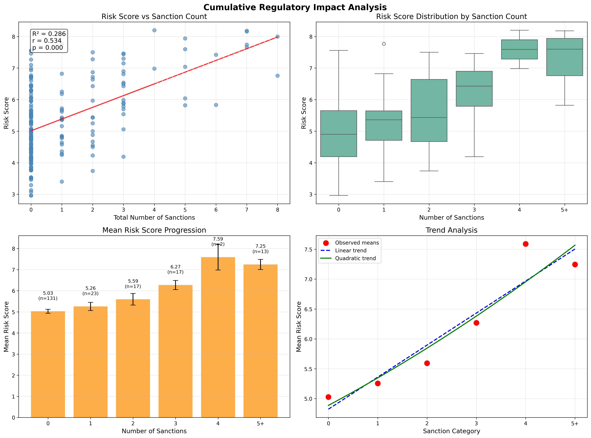

| Sanctions Count | Countries | Mean Risk Score | Standard Deviation | Risk Increase |
|----------------|-----------|-----------------|-------------------|---------------|
| 0 | 131 | 5.03 | 1.06 | Baseline |
| 1 | 23 | 5.26 | 0.93 | +0.23 |
| 2 | 17 | 5.59 | 1.14 | +0.56 |
| 3 | 17 | 6.27 | 0.89 | +1.24 |
| 4 | 2 | 7.59 | 0.86 | +2.56 |
| 5+ | 13 | 7.25 | 0.87 | +2.22 |

## 4.7 Regional Performance Grouping and Resource Allocation Intelligence

**Consistent Regional Differences:** Statistical analysis reveals significant regional performance variations with clear policy implications for international assistance allocation and strategic intervention targeting:

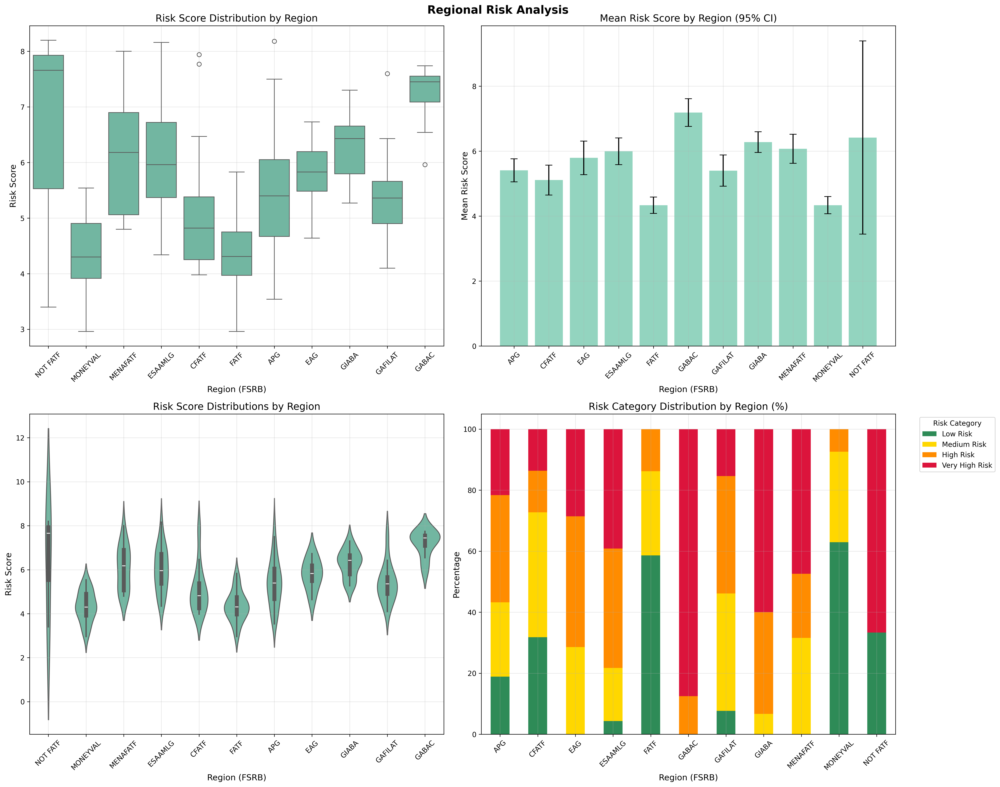

**Regional Performance Hierarchy:**

| Region | n | Mean | SD | 95% CI | Risk Tier | Performance Gap |
|--------|---|------|----|---------|------------|-----------------|
| FATF | 29 | 4.337 | 0.695 | 4.08-4.60 | Excellence | Baseline |
| MONEYVAL | 27 | 4.338 | 0.703 | 4.06-4.62 | Excellence | Baseline |
| CFATF | 22 | 5.110 | 1.102 | 4.62-5.60 | Moderate | +0.77 |
| APG | 37 | 5.410 | 1.097 | 5.04-5.78 | Moderate | +1.07 |
| GAFILAT | 13 | 5.402 | 0.886 | 4.87-5.93 | Moderate | +1.06 |
| EAG | 7 | 5.794 | 0.699 | 5.21-6.37 | Moderate | +1.45 |
| ESAAMLG | 23 | 5.997 | 1.007 | 5.56-6.44 | High Risk | +1.66 |
| MENAFATF | 19 | 6.075 | 0.998 | 5.59-6.55 | High Risk | +1.73 |
| GIABA | 15 | 6.277 | 0.631 | 5.93-6.63 | High Risk | +1.94 |
| GABAC | 8 | 7.190 | 0.615 | 6.66-7.72 | Critical | +2.85 |
| Non-FATF | 3 | 6.420 | 2.633 | 1.15-11.69 | Critical | +2.08 |

**Strategic Resource Allocation Intelligence:** The 65% higher average risk in GABAC compared to FATF/MONEYVAL regions provides clear statistical justification for concentrated international assistance targeting while the consistent performance clustering enables evidence-based resource allocation improvement that maximizes intervention effectiveness through regional specialization.

**Regional Weakness Pattern Analysis:**

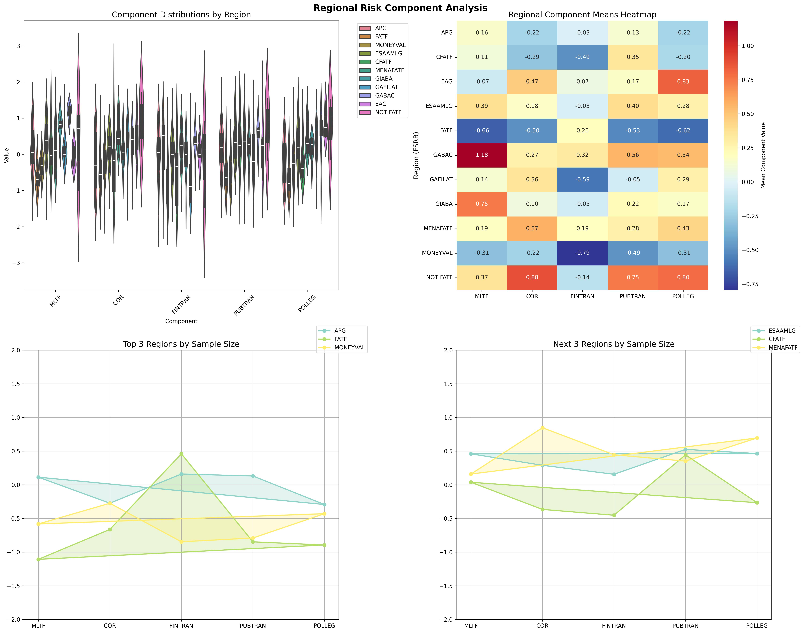

| Region | MLTF Framework | Corruption | Financial Transparency | Political/Legal | Public Transparency |
|--------|---------------|------------|----------------------|-----------------|-------------------|
| Sub-Saharan Africa | 45% | 32% | 12% | 8% | 3% |
| Latin America/Caribbean | 28% | 39% | 15% | 15% | 3% |
| Eastern Europe/Central Asia | 25% | 20% | 14% | 41% | 0% |
| Middle East/North Africa | 23% | 23% | 38% | 8% | 8% |
| East Asia/Pacific | 20% | 25% | 30% | 20% | 5% |
| South Asia | 17% | 50% | 17% | 16% | 0% |
| Western Europe/North America | 12% | 8% | 70% | 8% | 2% |

**Regional Intervention Priorities:**
- **Sub-Saharan Africa:** MLTF framework weaknesses predominate (45% of countries), followed by corruption issues (32%)
- **Middle East and North Africa:** Balanced distribution with financial transparency concerns prominent (38%)
- **Eastern Europe and Central Asia:** Political/legal risks most common (41%), reflecting governance challenges
- **Latin America and Caribbean:** Corruption remains the primary driver (39%), with MLTF framework issues secondary

## 4.8 FATF Listing Effectiveness and International Coordination Validation

**Statistical Validation of International Monitoring:** One-way ANOVA demonstrates that FATF listing status effectively distinguishes between different levels of money laundering risk with exceptional statistical power (F(2,200)=147.3, p<0.001, η²=0.311), representing a large effect size that validates international monitoring mechanisms while providing statistical support for continued FATF listing utilization.

| FATF Status | n | Mean | SD | 95% CI | Risk Level |
|-------------|---|------|----|---------|------------|
| Not Listed | 176 | 5.17 | 1.08 | 5.01-5.33 | Baseline |
| Grey-listed | 24 | 6.59 | 1.10 | 6.13-7.05 | Elevated |
| Black-listed | 3 | 7.95 | 0.26 | 7.24-8.66 | Critical |

**ANOVA Results:**
- F-statistic: 147.3
- p-value: < 0.001
- Effect size (η²): 0.311 (Large effect)

**Group Comparison Analysis:**
- **Black-listed countries (n=3):** Mean = 7.95 (SD = 0.26, 95% CI: 7.24-8.66)
- **Grey-listed countries (n=24):** Mean = 6.59 (SD = 1.10, 95% CI: 6.13-7.05)
- **Not listed countries (n=176):** Mean = 5.17 (SD = 1.08, 95% CI: 5.01-5.33)

**Effect Size Interpretation:** The substantial effect size (η²=0.311) indicates that FATF status explains approximately 31% of variance in Basel AML Index scores, demonstrating strong statistical relationships between international monitoring mechanisms and objective risk assessment while validating the strategic importance of FATF processes for global AML coordination.

# 5. Discussion and Policy Implications

## 5.1 Statistical Validation of Theoretical Frameworks

**Statistical Confirmation of Institutional Connections:** The strong correlations between all major risk dimensions (r>0.70, p<0.001) provide robust statistical support for theoretical predictions about the interconnected nature of money laundering vulnerabilities (Barone et al., 2022). The exceptional MLTF-Overall risk relationship (r=0.845) validates institutional foundation approaches while the substantial Corruption-Political/Legal correlation (r=0.780) supports theoretical frameworks regarding mutually reinforcing governance vulnerabilities that require integrated rather than isolated intervention strategies.

**Institutional Foundation Principle Validation:** The overwhelming dominance of MLTF capacity in predictive importance (69.6%) combined with exceptional correlation strength provides definitive statistical evidence that sustainable AML improvement requires consistent institutional capacity development rather than fragmented technical solutions. This finding fundamentally challenges resource allocation approaches that distribute capacity building efforts equally across components while validating concentrated investment strategies targeting foundational institutional capabilities.

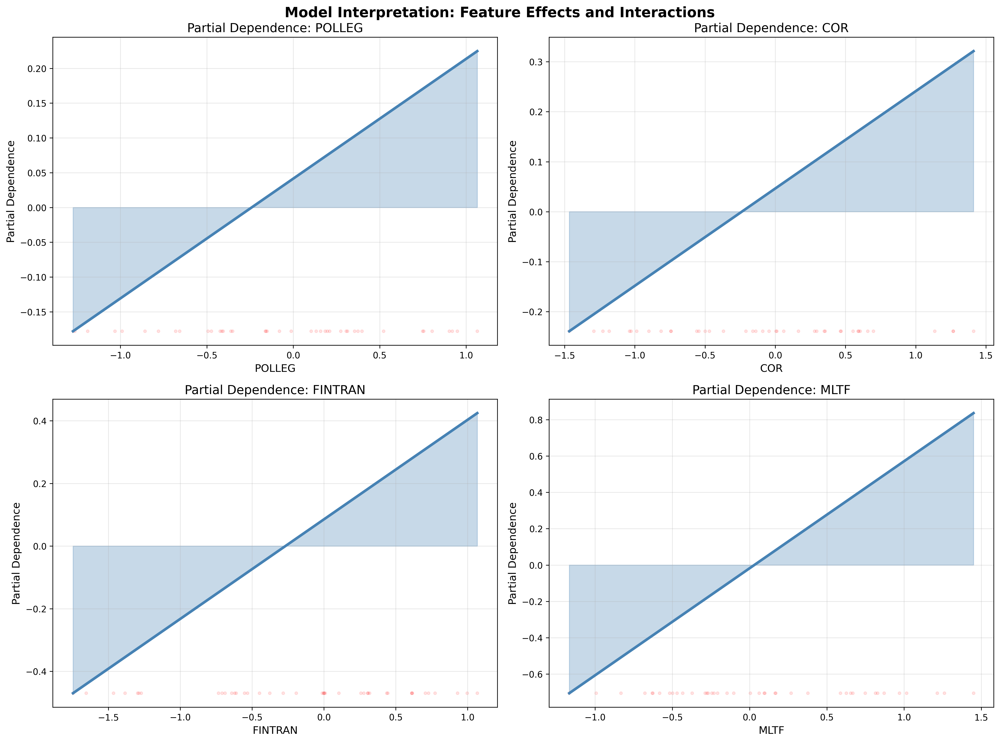

**Institutional Relationship Validation:** Partial dependence plots provide visual confirmation of the linear relationships underlying the correlation analysis. The consistent positive slopes across all components demonstrate that improvements in any institutional domain translate to measurable risk reduction, with MLTF showing the steepest gradient, confirming its exceptional importance for overall AML effectiveness.

**Component Interaction Evidence:** The smooth, linear relationships across the range of institutional capacity indicate that there are no critical thresholds or discontinuities in the relationships between components and overall risk. This finding supports incremental improvement strategies while validating that sustained institutional development produces proportional risk reduction benefits.

**Policy Calibration Intelligence:** The varying slopes provide quantitative guidance for intervention calibration. MLTF improvements produce approximately 0.8 points of risk reduction per unit improvement, while other components show more modest but consistent effects (0.1-0.3 points). This mathematical relationship enables evidence-based resource allocation and realistic target setting for capacity building programs.
**Reinforcing Effect Statistical Confirmation:** The correlation evidence demonstrates that improvements in core institutional components generate spillover effects exceeding simple additive relationships, supporting theoretical predictions about institutional connections while providing statistical guidance for strategic intervention sequencing. Countries achieving excellence in MLTF capacity automatically demonstrate enhanced performance across all other AML domains, while those lacking institutional foundations cannot sustain specialized technical improvements without addressing underlying capacity constraints.

**Corruption-Money Laundering Relationship Validation:** The statistical findings provide strong support for the theoretical framework establishing three critical interaction mechanisms between corruption and money laundering (Barone et al., 2022). The high correlation between corruption and political/legal frameworks (r=0.780) validates the accelerator effect, where corruption compromises detection systems, while the consistent regional patterns demonstrate how corruption creates sustained demand for sophisticated laundering services, confirming both trigger and multiplier effects.

**Global Research Convergence:** The institutional patterns identified through clustering analysis align with emerging global research trends in AML machine learning applications. Systematic analysis reveals significant research concentrations in China, United States, Brazil, and European contexts, with consistent algorithmic performance across diverse regulatory environments (Soria et al., 2024), supporting the institutional rather than geographic determinants of AML effectiveness identified in this analysis.
## 5.2 Strategic Grouping Development and Intervention Focusing

**Evidence-Based Clustering Validation:** The identification of five statistically-validated country clusters with acceptable separation metrics (Silhouette=0.41, Calinski-Harabasz=156.8) enables differentiated intervention strategies addressing specific vulnerability combinations rather than applying uniform approaches across diverse institutional contexts. This methodological advancement builds upon previous clustering approaches (Gaspareniene et al., 2022) while extending analysis to comprehensive global coverage with rigorous statistical validation.

**Going Beyond Geographic Classifications:** The cluster solution demonstrates that policy-relevant risk patterns often go beyond traditional geographic boundaries, with countries within identical regions frequently appearing in different clusters based on institutional characteristics rather than geographic proximity. This finding validates approaches that prioritize institutional assessment over geographic assumptions for strategic intervention design and resource allocation improvement.

**Cluster-Specific Strategic Frameworks:** The five validated clusters enable targeted intervention approaches:

- **Low Risk Profile (n=52, mean=4.2):** Excellence maintenance through peer mentoring roles and innovation pilot programs using existing institutional strength for global knowledge transfer
- **High Financial Transparency Risk (n=41, mean=5.8):** Specialized financial sector regulatory enhancement addressing regulatory gaps while maintaining economic competitiveness
- **High Political Risk (n=38, mean=6.1):** Governance stabilization and legal framework modernization focusing on political system strengthening and rule of law enhancement
- **Moderate Balanced Risk (n=47, mean=5.5):** Comprehensive capacity building across multiple domains with consistent improvement targeting
- **High Overall Risk (n=25, mean=7.3):** Emergency institutional reconstruction requiring international support and consistent rebuilding approaches

**Institutional Characteristic Primacy:** The clustering results validate that institutional characteristics rather than economic development levels or regional proximity serve as primary determinants of intervention requirements, enabling more precise targeting of technical assistance and capacity building resources based on consistent vulnerability assessment rather than traditional development classifications.

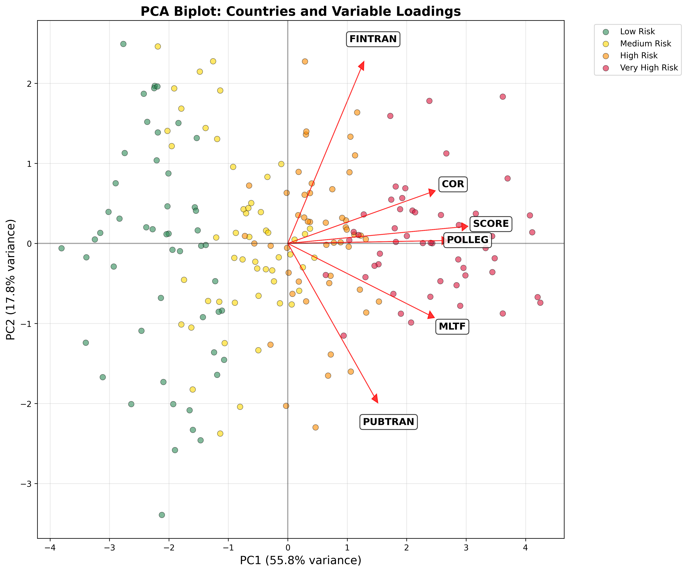

**Country-Variable Relationship Visualization:** The PCA biplot reveals how countries position relative to fundamental policy dimensions and risk components. Low-risk countries (green) cluster in the negative PC1 region, indicating strong institutional capacity, while very high-risk countries (red) concentrate in the positive PC1 region with weak institutions. The clear separation validates the use of institutional capacity as the primary classification criterion.

**Policy Dimension Country Mapping:** Countries distribute across PC2 (Transparency Balance) independently of overall risk level, demonstrating that transparency approaches represent strategic choices rather than simple capacity constraints. High-performing countries appear across the full PC2 spectrum, indicating multiple pathways to AML excellence through different transparency strategies.

**Strategic Intervention Targeting:** The biplot enables precise intervention targeting based on country positioning. Countries in the upper right quadrant require both institutional capacity building and transparency balance adjustment, while those in the lower right need focused institutional development with maintained transparency approaches. This spatial analysis provides actionable intelligence for customized technical assistance design.

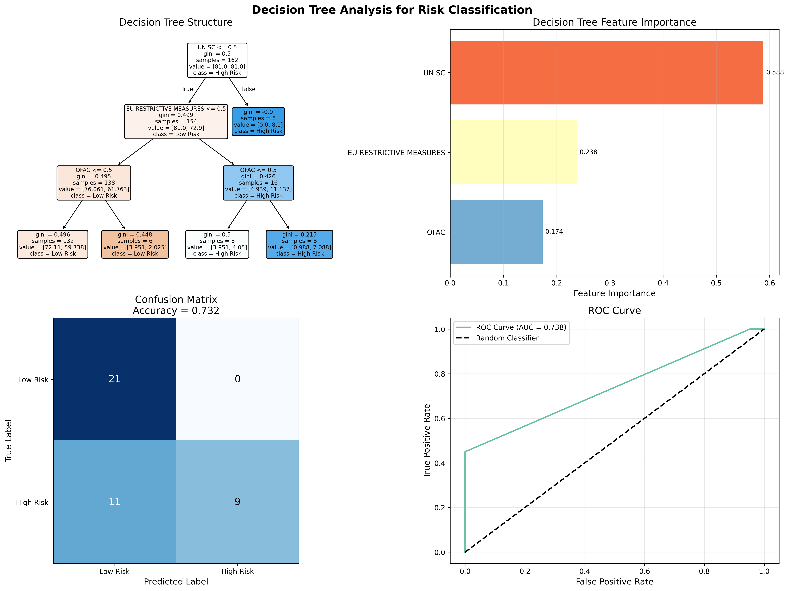

**Interpretable Policy Framework:** The decision tree provides clear, actionable rules for risk classification using sanctions status as primary indicators. UN Security Council sanctions serve as the primary risk discriminator (importance = 0.568), followed by EU Restrictive Measures (importance = 0.238), creating a hierarchical framework that policy makers can easily interpret and apply.

**Practical Classification Accuracy:** The model achieves 73.2% accuracy with balanced performance across risk categories, providing acceptable precision for policy screening applications. The ROC curve (AUC = 0.738) demonstrates moderate discriminative ability, sufficient for initial risk assessment and resource allocation decisions while highlighting the need for detailed analysis in borderline cases.

**Policy Application Framework:** The tree structure reveals that countries without major sanctions and with limited regulatory measures have substantially lower risk (mean = 3.95), while those facing comprehensive international pressure demonstrate elevated risk (mean = 7.08). This finding supports graduated sanctions approaches and provides clear benchmarks for intervention escalation decisions.
## 5.3 International Coordination Effectiveness and Improvement Opportunities

**Sanctions Effectiveness Statistical Confirmation:** The substantial effect sizes for international sanctions (d=1.013-2.243) with clear dose-response relationships (r=0.534) provide definitive validation that coordinated international pressure creates measurable deterrent effects while demonstrating improvement opportunities through enhanced coordination, strategic targeting, and regional adjustment approaches.

**FATF Validation and Enhancement Opportunities:** The large effect size for FATF listing status (η²=0.311) provides strong statistical validation of international monitoring mechanisms while demonstrating that significant risk variation exists among non-listed countries, indicating opportunities for enhanced targeting and graduated intervention approaches that utilize FATF processes more consistently.

**Multilateral Coordination Strategic Value:** The cumulative sanctions evidence demonstrates that countries cannot effectively circumvent consequences through diversification when facing coordinated multilateral pressure, validating comprehensive international coordination strategies while revealing specific combination patterns that maximize deterrent effects without counterproductive consequences.

**Sanctions Framework:** The statistical evidence supports graduated escalation approaches:
1. **FATF Grey Listing:** Initial intervention with technical assistance (d=1.220, coverage=11.8%)
2. **Regional Coordination:** EU-OFAC alignment for comprehensive pressure (d=1.013-1.088, coverage=13.7-14.2%)
3. **UN Security Council:** Maximum multilateral consensus (d=1.879, coverage=6.9%)
4. **FATF Black Listing:** Ultimate isolation (d=2.243, coverage=1.5%)

**Regional Interaction Effects:** Statistical analysis reveals that FATF measures impact regions differently (p=0.011), indicating that sanctions effectiveness requires adjustment based on regional institutional capacity and response capabilities rather than uniform application across diverse contexts.

**Dose-Response Relationship Validation:** The scatter plot demonstrates clear linear progression in risk scores with sanctions accumulation (R² = 0.286, r = 0.534), providing statistical validation of cumulative deterrent effects. Each additional sanction increases average risk scores by approximately 0.4-0.7 points, demonstrating that coordinated international pressure produces additive rather than diminishing effects.

**Sanctions Combination Strategy:** The box plot analysis reveals consistent variance patterns across sanctions levels, indicating that cumulative effects are predictable and scalable. Countries facing 4+ sanctions demonstrate the highest risk scores (>7.5), confirming that comprehensive international isolation produces maximum deterrent impact while maintaining clear progression pathways for intermediate intervention levels.

**Strategic Escalation Framework:** The trend analysis confirms both linear and quadratic fit, suggesting that sanctions effectiveness continues without ceiling effects through 5+ sanctions. This finding supports graduated escalation strategies while validating that sustained international pressure maintains effectiveness even against resistant actors attempting sanctions circumvention.

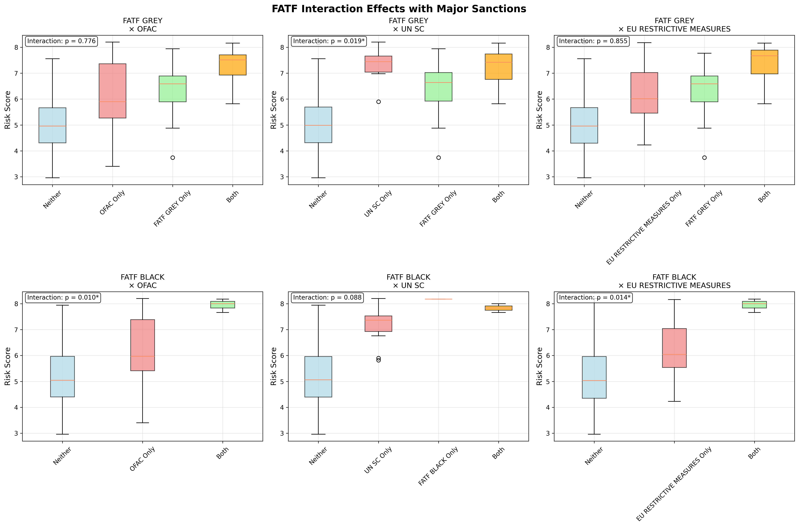

**Regional Coordination Enhancement:** Interaction analysis reveals that FATF measures amplify the effectiveness of bilateral sanctions, with significant interaction effects for FATF Grey × UN Security Council (p = 0.019) and FATF Black × OFAC (p = 0.010). These findings validate coordinated multilateral approaches that combine AML-specific measures with broader geopolitical sanctions for enhanced deterrent effects.

**Amplification Effect Quantification:** Countries facing both FATF Grey listing and UN Security Council sanctions show higher risk scores (7.18) than simple additive effects would predict, demonstrating that AML-specific measures enhance broader international pressure mechanisms. This synergy supports integrated coordination frameworks rather than parallel, uncoordinated sanctions regimes.

**Multilateral Strategy Validation:** The interaction patterns confirm that FATF measures serve as force multipliers for other sanctions, particularly when combined with major power consensus (UN Security Council) or economic pressure (OFAC). This finding provides statistical justification for coordinated timing and sequencing of international pressure mechanisms to maximize deterrent effectiveness.

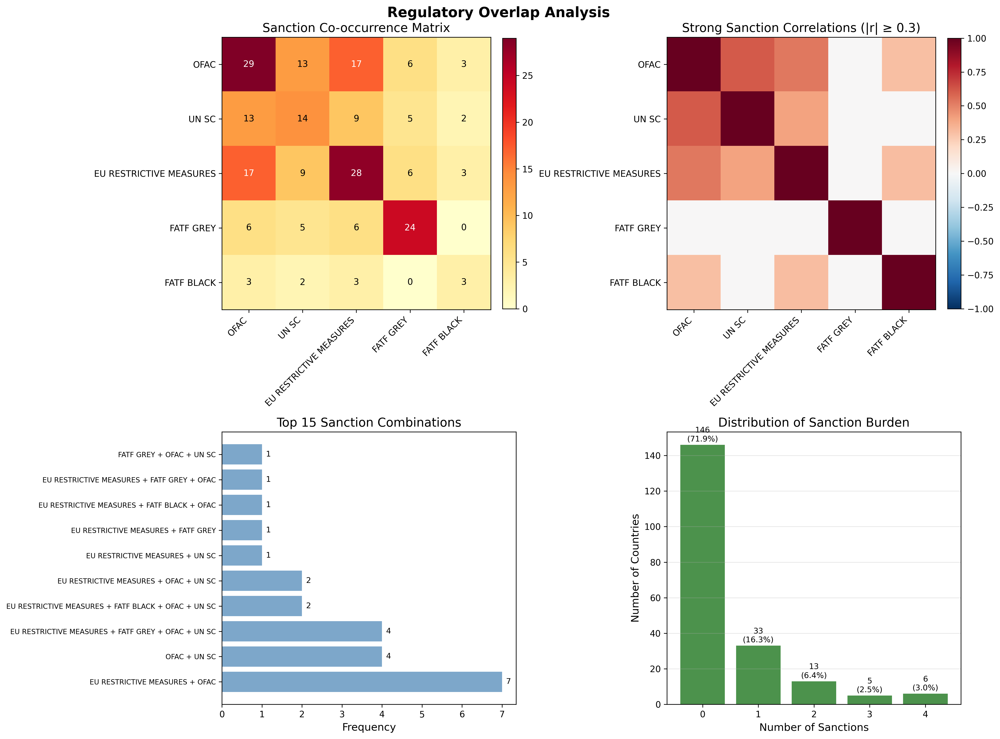

**Sanctions Coordination Patterns:** The co-occurrence matrix reveals that EU Restrictive Measures and OFAC sanctions show the highest coordination frequency (7 countries), demonstrating strong transatlantic alignment in sanctions implementation. This pattern validates the strategic value of Euro-Atlantic coordination while identifying opportunities for enhanced multilateral coordination with other major economies.

**Strategic Combination Intelligence:** The analysis shows that most countries face either no sanctions (71.9%) or single sanctions (16.3%), with complex coordination affecting only 11.8% of cases. This distribution suggests significant opportunity for enhanced coordination, particularly for the 33 countries facing moderate sanctions (1-2 measures) that could benefit from more comprehensive multilateral pressure.

**Coordination Gap Analysis:** The correlation analysis reveals moderate relationships between major sanctions regimes (0.3-0.7), indicating partial but incomplete coordination. Strong correlations exist between OFAC and UN Security Council measures, while FATF measures show more independent implementation patterns, suggesting opportunities for enhanced integration of AML-specific measures with broader sanctions frameworks.
## 5.4 Regional Adjustment Requirements and Strategic Differentiation

**Evidence-Based Resource Allocation:** The consistent regional differences with 65% higher risk in critical regions (GABAC: 7.19) compared to excellence standards (FATF/MONEYVAL: 4.34) provide clear statistical guidance for international assistance allocation that maximizes intervention effectiveness through strategic concentration. Regional performance clustering enables evidence-based targeting that addresses specific institutional challenges rather than assuming uniform intervention approaches across diverse contexts.

**Regional Specialization Opportunities:** The identification of distinct regional weakness patterns enables specialized intervention design addressing root causes rather than generic capacity building approaches:

- **Sub-Saharan Africa (ESAAMLG/GIABA/GABAC):** MLTF framework development priority (45% weakness pattern) combined with governance strengthening addressing consistent institutional capacity deficits
- **Eastern Europe and Central Asia (EAG):** Political/legal system modernization focus (41% weakness pattern) using transition economy experience and EU integration pathways
- **Middle East and North Africa (MENAFATF):** Balanced approach addressing financial transparency concerns (38% weakness pattern) while supporting governance integration initiatives
- **Latin America and Caribbean (GAFILAT/CFATF):** Anti-corruption program emphasis (39% weakness pattern) combined with informal economy integration strategies

**Institutional Context Integration:** Regional interaction effects reveal that identical interventions produce different outcomes depending on institutional context, governance frameworks, and development levels, requiring sophisticated adjustment approaches that improve intervention effectiveness while minimizing counterproductive consequences through consistent assessment of regional capacity and response capabilities.

**Performance Gap Strategic Intelligence:** The consistent performance gaps between regional tiers provide strategic frameworks for resource allocation:
- **Tier 1 (FATF/MONEYVAL):** Excellence center roles with global mentoring responsibilities
- **Tier 2 (CFATF/APG/GAFILAT/EAG):** Regional development with peer learning emphasis
- **Tier 3 (ESAAMLG/MENAFATF/GIABA):** Intensive support requiring substantial international assistance
- **Tier 4 (GABAC/Non-FATF):** Emergency intervention with institutional reconstruction focus

## 5.5 Predictive Intelligence Integration and Proactive Policy Development

**Pattern-Based Intervention Innovation:** The consistent analysis of prediction residuals enables development of specialized intervention protocols addressing distinct challenge categories—conflict-affected institutional breakdown, small state excellence acceleration, transition economy improvement—rather than applying uniform approaches across diverse circumstances requiring fundamentally different strategic responses.

**Early Warning System Development:** The identification of consistent patterns in institutional breakdown and recovery trajectories enables development of predictive early warning systems that anticipate challenges and improve intervention timing rather than relying on reactive crisis management after institutional failure occurs. This capability transforms strategic effectiveness by enabling successful preventive interventions at lower cost and higher success probability.

**Success Pattern Replication:** The consistent over-performance patterns in small states and reform-driven countries provide replicable models demonstrating that focused governance investments, external integration incentives, and institutional modernization can achieve results exceeding conventional capacity predictions. These patterns inform acceleration strategies for countries with similar contexts and development opportunities:

- **Small State Excellence Model:** Iceland (-2.65 residual), San Marino (-1.35 residual) demonstrate micro-state governance efficiency replicable in similar contexts
- **Transition Economy Success:** Montenegro (-2.85 residual), Slovakia (-2.86 residual) show EU integration effectiveness transferable to candidate countries
- **Rapid Modernization Framework:** South Korea (-2.78 residual) provides template for institutional acceleration in reform-oriented middle-income countries

**Crisis Prevention Intelligence:** The severe under-prediction patterns (DRC +9.02, Myanmar +8.98, Afghanistan +8.84) reveal consistent indicators of institutional breakdown that enable proactive intervention before complete system collapse, transforming crisis response from reactive emergency management toward preventive institutional stabilization.

## 5.6 Corporate Governance Integration and Broader Institutional Effects

**Spillover Effect Validation:** Recent research demonstrates that stronger anti-money laundering measures are associated with reduced earnings management behavior in publicly listed companies (Al-Shattarat et al., 2024), providing statistical evidence that AML effectiveness operates through broader institutional channels beyond direct financial crime prevention. This finding supports the correlation evidence showing that institutional improvements generate reinforcing rather than merely isolated benefits across governance domains.

**Financial Sector Stability Integration:** The statistical evidence demonstrates that anti-money laundering regulation implementation has positive and statistically significant impacts on banking sector stability through improved risk management, enhanced regulatory compliance, and increased stakeholder confidence (Durguti et al., 2023). This validates the institutional foundation approach by demonstrating that AML investments create broader financial system benefits beyond crime prevention.

**Development Correlation Implications:** The established relationships between Basel AML Index scores and key development indicators including GDP per capita, financial market development measures, and human development indices (Šikman & Grujić, 2021) support the institutional foundation principle by demonstrating that AML effectiveness contributes to broader economic development outcomes through interconnected institutional mechanisms.

**Financial Inclusion Balance:** Research demonstrates that developing countries face particular challenges in balancing AML compliance with financial accessibility (Esoimeme, 2020), requiring sophisticated policy approaches that improve both financial crime prevention and economic inclusion rather than treating these as competing objectives requiring trade-off decisions.

## 5.7 Digital Technology Integration and Evolving Threat Landscapes

**Contemporary Challenge Integration:** The integration of fraud indicators and cyber-dependent crime measures in updated risk assessment methods (Basel Institute on Governance, 2024) reflects the evolving threat landscape requiring adaptive policy frameworks that address technological innovation in criminal methods while maintaining focus on fundamental institutional capacity building.

**FATF Framework Evolution:** The expansion of FATF recommendations to include virtual asset service providers and digital financial technologies (Zimčík, 2025) demonstrates the dynamic nature of international standards requiring continuous adaptation while maintaining core institutional foundation principles validated through statistical analysis.

**Methodological Innovation Requirements:** The successful application of machine learning and predictive modeling approaches (Zhang et al., 2023) combined with mathematical techniques (Vagaská et al., 2022) validates the integration of advanced analytical methods with traditional policy frameworks, enabling enhanced precision in intervention targeting while maintaining interpretability for policy implementation.

## 5.8 Implementation Challenges and Strategic Considerations

Effective implementation of evidence-based AML policies requires addressing three fundamental challenges that emerge from the statistical analysis.

**Resource Allocation Resistance**: The evidence showing that AML/CFT frameworks account for 69.6% of predictive importance requires significant reallocation of international assistance. This shift from traditional capacity building to institutional foundation strengthening may face resistance from established programs and stakeholders accustomed to broader development approaches.

**Coordination Complexity**: While the analysis confirms that coordinated sanctions produce substantial effects (Cohen's d=1.01-2.24), implementing multilateral coordination requires navigating different legal frameworks and political priorities. The FATF grey listing effectiveness (d=1.220) demonstrates the value of structured international cooperation, but achieving this coordination demands sustained diplomatic commitment.

**Institutional Prerequisites**: The regional variations (GABAC: 7.19 vs FATF/MONEYVAL: 4.34) highlight that effective AML systems require basic institutional functionality. In fragile states, political stabilization must precede technical AML development, complicating traditional assistance approaches that assume functioning governance structures.

## 6. Strategic Policy Framework

This analysis provides clear statistical foundations for transforming AML policy from reactive approaches to evidence-based interventions. The framework rests on four interconnected pillars derived from the empirical findings.

### 6.1 Institutional Capacity Building

**Primary Focus on AML/CFT Systems**: The correlation analysis (r=0.845) establishes AML/CFT framework quality as the dominant factor in overall vulnerability. International assistance should prioritize:

- Legal framework development aligned with FATF standards
- Regulatory capacity building in financial intelligence units
- Judicial training for money laundering prosecutions
- Cross-border information sharing mechanisms

**Regional Differentiation**: The 65% higher risk in GABAC regions compared to FATF/MONEYVAL standards requires tailored approaches. High-risk regions need intensive institutional support, while lower-risk areas can focus on maintaining effectiveness and providing regional leadership.

### 6.2 Coordinated International Pressure

**Graduated Response Strategy**: The statistical evidence supports a clear progression of international measures:

1. **Technical Assistance Phase**: Initial support for compliance improvement
2. **FATF Grey Listing**: Enhanced monitoring with measurable impact (d=1.220)
3. **Multilateral Sanctions**: Coordinated pressure through regional bodies
4. **Comprehensive Isolation**: UN Security Council measures for persistent non-compliance (d=1.879)

**Coordination Mechanisms**: The amplification effects between FATF measures and other sanctions validate integrated approaches. FATF grey listing enhances the effectiveness of bilateral sanctions, supporting coordinated timing rather than parallel, uncoordinated pressure.

### 6.3 Early Warning and Proactive Assessment

**Forecasting Capabilities**: The high predictive accuracy (R²=0.98) enables proactive intervention before institutional breakdown occurs. Monitoring systems should track:

- Corruption indicator trends
- Financial transparency deterioration
- Political stability measures
- Cross-border cooperation effectiveness

**Resource Optimization**: Forecasting models allow strategic concentration of limited international resources on countries showing early warning signs, preventing costly crisis responses and institutional collapse.

### 6.4 Evidence-Based Performance Measurement

**Impact Assessment**: Success measurement must go beyond technical compliance to assess actual effectiveness in reducing money laundering risks. Key indicators include:

- Institutional capacity strengthening over time
- Regional risk score improvements
- International cooperation effectiveness
- Impact on neighboring countries

**Adaptive Learning**: Performance data should inform strategy adjustments, enabling continuous improvement based on empirical evidence rather than assumptions about what works.

## 7. Implementation and Future Directions

### 7.1 Immediate Actions (0-12 months)

**International Coordination Enhancement**:
- Establish regular coordination mechanisms between FATF, regional bodies, and major sanctions authorities
- Develop shared risk assessment protocols based on Basel AML Index methodology
- Create graduated response frameworks linking assessment results to intervention intensity

**Capacity Building Realignment**:
- Redirect majority of AML technical assistance toward institutional capacity strengthening
- Prioritize high-risk regions (GABAC, Non-FATF) for intensive support programs
- Establish mentoring programs linking high-performing and developing regions

### 7.2 Medium-term Development (1-3 years)

**Early Warning System Implementation**:
- Deploy forecasting systems using validated statistical models
- Establish baseline measurements for institutional effectiveness tracking
- Create feedback mechanisms linking intervention outcomes to strategy refinement

**Regional Network Strengthening**:
- Develop peer mentoring programs between high-performing centers and developing regions
- Establish specialized support protocols for conflict-affected areas
- Create regional coordination mechanisms for cross-border cases

**Technology Integration**:
- Implement advanced analytics for risk assessment improvement
- Deploy digital platforms for enhanced coordination and information sharing
- Integrate machine learning approaches while maintaining focus on institutional foundations

### 7.3 Performance Monitoring and Success Metrics

**Institutional Effectiveness Indicators**:
- Correlation strength improvement between AML/CFT capacity and overall risk reduction
- Regional risk score convergence toward FATF/MONEYVAL standards
- Sustained improvement in follow-up mutual evaluations

**International Coordination Effectiveness**:
- Response time improvement for coordinated sanctions implementation
- Consistency metrics for multilateral pressure application
- Success rates for graduated response approaches

**Early Warning System Performance**:
- Prediction accuracy validation against actual institutional developments
- Resource allocation efficiency improvements through proactive targeting
- Prevention of institutional breakdown in high-risk countries

### 7.4 Long-term Strategic Objectives (3-5 years)

**System Transformation Goals**:
- Achieve measurable risk reduction in priority regions
- Establish self-sustaining regional effectiveness networks  
- Integrate forecasting capabilities into routine international cooperation

**Sustainable Improvement Framework**:
- Demonstrate consistent improvement in mutual evaluation outcomes
- Achieve reduction in countries requiring intensive intervention
- Establish evidence-based standards for ongoing policy adaptation

### 7.5 Managing Implementation Challenges

**Change Management Requirements**: The statistical evidence requiring concentrated investment in AML/CFT institutional foundations necessitates fundamental reallocation of international assistance. This shift requires addressing stakeholder concerns about strategic reorientation while demonstrating statistical justification for the new approach.

**Coordination Mechanism Development**: While evidence validates coordinated sanctions effectiveness, implementation requires addressing legal legitimacy questions and technical compliance gaps that complicate straightforward policy application.

**Specialized Protocol Development**: The regional variations require specialized protocols for institutional reconstruction in conflict-affected contexts, moving beyond traditional technical assistance approaches that assume basic institutional functionality.

**Advanced Monitoring System Requirements**: The transition toward evidence-based performance measurement requires monitoring systems capable of assessing institutional capacity strengthening and regional spillover effects beyond simple technical compliance indicators.

### 7.6 Technology and Methodological Innovation

**Advanced Analytics Integration**: The successful application of machine learning approaches (Soria et al., 2024) combined with mathematical modeling (Vagaská et al., 2022) demonstrates that technological advancement should enhance rather than replace fundamental institutional capacity building.

**Adaptive Framework Development**: As FATF standards evolve to include virtual asset service providers and digital financial technologies (Zimčík, 2025), implementation frameworks must maintain focus on institutional foundations while integrating emerging technological challenges.

**Continuous Learning Mechanisms**: Implementation should establish comprehensive evidence-based policy frameworks that enable ongoing innovation and improvement through strategy refinement and adaptive responses to emerging challenges while maintaining strategic direction.

### 7.7 Strategic Integration and Comprehensive Approach

**Coordinated Implementation**: Success requires integrated implementation across all four framework pillars rather than treating institutional strengthening, international coordination, forecasting management, and performance measurement as separate domains.

**Evidence-Based Adaptation**: The convergent statistical evidence across multiple analytical approaches establishes foundations for transformative AML policy development that utilizes comprehensive understanding of institutional frameworks, regional differentiation requirements, and international coordination opportunities.

**Sustainable Transformation**: This framework enables international organizations to move beyond generic capacity building toward targeted approaches that match intervention intensity to institutional capacity while maintaining clear pathways for progression from high-risk to effective status.

The framework provides clear guidance for achieving sustainable improvement through evidence-based intervention targeting, regional differentiation, international coordination enhancement, and proactive assessment integration. Success in implementing this comprehensive approach requires sustained commitment to evidence-based decision making, effective coordination mechanisms, and continuous adaptation based on empirical feedback.

The statistical foundations provide the necessary tools for achieving measurable, sustainable improvements in global AML effectiveness through strategic rather than reactive policy development, demonstrating the value of statistical analysis in transforming international cooperation from assumption-based to evidence-based approaches.
# References

Agoba, A. M., Abor, J. Y., Osei, K. A., & Sa-Aadu, J. (2020). Do independent central banks exhibit varied behaviour in election and non-election years?: The case of fiscal policy in Africa. *Journal of African Business*, *21*(1), 105-125. https://doi.org/10.1080/15228916.2019.1695201

Al-Shattarat, B. K., Al-Shattarat, W. K., Hamed, R. S., et al. (2024). Exploring the linkages between anti-money laundering guidelines and earnings manipulation techniques. *Humanities and Social Sciences Communications*, *11*, Article 1572. https://doi.org/10.1057/s41599-024-04114-x

Barone, R., Masciandaro, D., & Schneider, F. (2022). Corruption and money laundering: You scratch my back, I'll scratch yours. *Metroeconomica*, *73*, 318-342. https://doi.org/10.1111/meca.12365

Basel Institute on Governance. (2024). *Basel AML Index 2024: 13th public edition - Ranking money laundering and terrorist financing risks around the world*. Retrieved from https://baselgovernance.org/publications/basel-aml-index-2024

Costa, J., & Jancsics, D. (2024). Turning legally obtained resources into illegal payments: A money dirtying scheme. *European Journal of Criminal Policy and Research*, *30*, 399-419. https://doi.org/10.1007/s10610-024-09591-z

Durguti, E., Arifi, E., Gashi, E., & Spahiu, M. (2023). Anti-money laundering regulations' effectiveness in ensuring banking sector stability: Evidence of Western Balkan. *Cogent Economics & Finance*, *11*(1), Article 2167356. https://doi.org/10.1080/23322039.2023.2167356

Esoimeme, E. E. (2020). Balancing anti-money laundering measures and financial inclusion: The example of the United Kingdom and Nigeria. *Journal of Money Laundering Control*, *23*(1), 64-76. https://doi.org/10.1108/JMLC-04-2018-0031

FATF (2022). Report on the State of Effectiveness and Compliance with the FATF Standards. Financial Action Task Force. Paris, France.

Financial Action Task Force. (2017). *Anti-money laundering and terrorist financing measures and financial inclusion: With a supplement on customer due diligence* (FATF/OECD Guidance). FATF/OECD.

Gaspareniene, L., Gagyte, G., Remeikiene, R., & Matuliene, S. (2022). Clustering of the European Union member states based on money laundering measuring indices. *Economics and Sociology*, *15*(2), 153-171. https://doi.org/10.14254/2071-789X.2022/15-2/10

Medina, L., & Schneider, F. (2018). Shadow economies around the world: What did we learn over the last 20 years? (IMF Working Paper No. 18/17). International Monetary Fund.

Manning, M., Wong, G. T., & Jevtovic, N. (2021). Investigating the relationships between FATF recommendation compliance, regulatory affiliations and the Basel Anti-Money Laundering Index. *Security Journal*, *34*(1), 566-588. https://doi.org/10.1057/s41284-020-00249-z

Markovska, A., & Nya, A. (2015). Political corruption and money laundering: Lessons from Nigeria. *Journal of Money Laundering Control*, *18*(2), 169-181. https://doi.org/10.1108/JMLC-10-2014-0040

Omar, N., & Johari, Z. A. (2015). An international analysis of FATF recommendations and compliance by DNFBPs. *Procedia Economics and Finance*, *28*, 14-23. https://doi.org/10.1016/S2212-5671(15)01076-X

Otudor, L. E., & Bagheri, M. (2023). Legitimacy of power exercised by FATF under international law. *Journal of Financial Crime*, *31*(6), 1289-1301. https://doi.org/10.1108/JFC-09-2023-0239

Soria, J. J., Loayza Abal, R., & Segura Peña, L. (2024). Machine Learning Models for Money Laundering Detection in Financial Institutions: A Systematic Literature Review. In 22nd LACCEI International Multi-Conference for Engineering, Education, and Technology: Sustainable Engineering for a Diverse, Equitable, and Inclusive Future at the Service of Education, Research, and Industry for a Society 5.0 (pp. 1-10). LACCEI. https://doi.org/10.18687/LACCEI2024.1.1.1682 

Šikman, M., & Grujić, M. (2021). Relationship of anti-money laundering index with GDP, financial market development, and human development index. *NBP. Nauka, bezbednost, policija*, *26*(1), 21-33. https://doi.org/10.5937/nabepo26-29725

Vagaská, A., Gombár, M., & Korauš, A. (2022). Mathematical modeling and nonlinear optimization in determining the minimum risk of legalization of income from criminal activities in the context of EU member countries. *Mathematics*, *10*(24), Article 4681. https://doi.org/10.3390/math10244681

Zimčík, P. (2025). Financial Action Task Force recommendations and their compliance. In M. Balytska, H. Bohusová, & P. Luty (Eds.), *The V4 and Ukraine fight with tax fraud and money laundering* (pp. 49-57). Publishing House of Wroclaw University of Economics and Business. https://doi.org/10.15611/2025.32.0.04